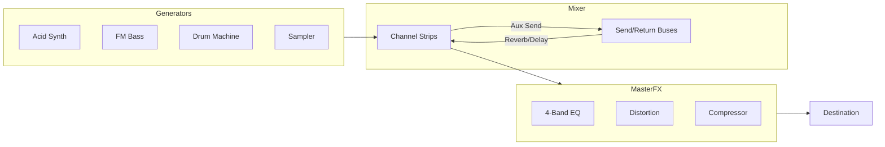

# Architecture Overview

The **Midi Studio** is a Progressive Web App (PWA) designed for generative music creation and visualization. It combines a high-performance audio engine (Tone.js), a reactive 3D visual system (React Three Fiber), and a Node.js backend for Telegram integration.

## System Context

```mermaid
graph TD
    User((User))
    
    subgraph Client [Frontend (PWA)]
        UI[React UI]
        Audio[Audio Engine (Tone.js)]
        Visuals[Visual Engine (R3F)]
        Store[Zustand Stores]
    end
    
    subgraph Server [Backend]
        API[Express API]
        Bot[Telegram Bot]
    end
    
    Telegram((Telegram Cloud))

    User -->|Interacts| UI
    User -->|Gestures/MIDI| Visuals
    
    UI -->|Actions| Store
    Visuals -->|Reads State| Store
    
    Store -->|Controls| Audio
    Store -->|Controls| Visuals
    Audio -->|Audio Analysis| Visuals
    
    Audio -->|Export MIDI| API
    API -->|Send File| Bot
    Bot -->|Delivers| Telegram
```

## Frontend Architecture

The frontend is built with **React** and uses **Zustand** for state management, decoupling the UI from the high-frequency audio and visual loops.

### State Management (Zustand)

The application state is split into domain-specific stores to prevent unnecessary re-renders:

| Store | Purpose | Key Responsibilities |
|-------|---------|----------------------|
| `audioStore` | Audio Engine | Manages Tone.js nodes, synth instances, effects chain, mixer, and transport. |
| `visualStore` | Visual Engine | Manages 3D scenes, camera, active visualizers, and shader parameters. |
| `sequencerStore`| Logic | Handles the 16-step sequencer, probability gates, and pattern generation. |
| `arrangementStore`| Timeline | Manages song structure, clips, and track freezing. |
| `instrumentStore` | Instruments | Specific parameters for Drums, Bass, Pads, etc. |

### Audio Engine (Tone.js)

The audio graph is dynamic but follows a general signal flow:



### Visual Engine (React Three Fiber)

The visual engine runs a separate render loop (`useFrame`). To maintain 60FPS:
1.  **Transient Updates:** High-frequency data (FFT analysis, hand coordinates) is updated directly in refs or via `useVisualStore.getState()`, bypassing React state updates.
2.  **Shader Instancing:** Particles and stars use `InstancedMesh` for performance.
3.  **Post-Processing:** Effects like Bloom and Chromatic Aberration are applied via `@react-three/postprocessing`.

## Backend Architecture

The backend is a lightweight Node.js/Express service primarily used for:
1.  **Telegram Mini App Authentication:** Validates `initData` to ensure requests come from a legitimate Telegram user.
2.  **MIDI Export:** Receives generated MIDI data from the frontend and sends it to the user as a file via the Telegram Bot API.

### Security
*   **Replay Attack Protection:** Checks `auth_date` to reject stale requests (>24h).
*   **HMAC Validation:** Verifies the cryptographic signature of Telegram data.
*   **Sanitization:** Filenames are sanitized to prevent path traversal.

## Directory Structure

```
├── backend/            # Express server & Bot logic
│   ├── server.ts       # Entry point
│   └── test-*.ts       # API tests
├── src/
│   ├── components/     # React UI components
│   │   ├── 3D/         # R3F scenes
│   │   ├── UI/         # HUD, Knobs, Panels
│   │   └── WebGL/      # Visualizers
│   ├── logic/          # Audio & Synth classes (Tone.js wrappers)
│   ├── store/          # Zustand state definitions
│   ├── hooks/          # Custom hooks (sequencers, gestures)
│   └── data/           # Presets and static data
├── docs/               # Documentation
└── public/             # Static assets (sounds, textures)
```
